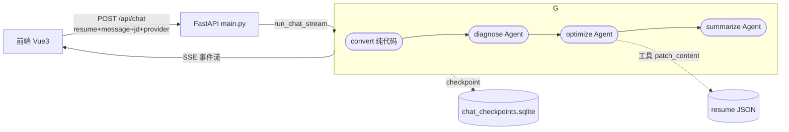

# SmartCV 后端 Agent 技术文档

> 面向想搞清楚"多 Agent 到底怎么跑"的人：流程、事件、工具、坐标、技能、检查点、流式实现。
> 所有代码在 `smartcv-api/agents/`，入口在 `smartcv-api/main.py`。

---

## 1. 架构总览

后端是 **LangGraph 编排的多 Agent 流水线 + 工具 + SSE 流式**。一句话概括：

> 把简历拍平成带坐标的文本 → LLM 诊断 → LLM 按坐标就地改 JSON → LLM 总结给用户。



- **图状态**（`ChatState`）：`resume_sections / markdown / diagnosis / summary / result_json`。
- **生产者**：图内所有事件（`status / agent_start / delta / tool_call / tool_result / agent_end`）都经 `get_stream_writer()` 发成 LangGraph custom 事件。
- **消费者**：`run_chat_stream` 用 `astream(stream_mode=["updates","custom"])` 统一收取，`custom` 载荷通过 `emit(chunk)` 转成 SSE 推给前端——**单一生产者，事件顺序与图内执行完全一致**。

---

## 2. 目录结构

```text
agents/
├── md2json/            # 解析 Agent：PDF/Word 文本 → 简历 JSON
│   ├── agent.py        #    合并单 Agent（加载 md2md 技能 + generate_resume 工具）
│   ├── tools.py        #    make_section_tools（generate_resume）
│   └── schemas/        #    resume.py（Section/内容类型）、store.py（进度状态）
├── optimize/           # 优化流水线（对话）
│   ├── graph.py        #    run_chat_stream：LangGraph 编排 + SSE 入口
│   ├── diagnose_agent.py   # 诊断 Agent
│   ├── optimize_agent.py   # 优化 Agent（带工具）
│   ├── summarize_agent.py  # 摘要 Agent
│   ├── tools.py        #    patch_content / get_resume_markdown + OptimizeStore
│   ├── markdown.py     #    简历 JSON ↔ 带坐标标记文本 + 按坐标定位/写回
│   ├── checkpointer.py #    AsyncSqliteSaver 单例 + clear_checkpoints
│   └── schemas/task.py #    ChatTask：SSE 事件通道（queue 背压 + deque id 缓存）
├── polish/             # 润色 Agent（批量列表文本）
├── skill/              # 可按需加载的技能
│   ├── md2md/          #    乱序文本 → 带标记的简历文本
│   └── optimize/       #    坐标改写技能说明
└── utils/
    ├── choose_llm.py   # 选模型（ChatOpenAI，OpenAI 兼容）
    └── skillmiddleware.py  # SkillMiddleware：按白名单注入技能工具
```

---

## 3. 核心流水线：诊断 → 优化 → 摘要

`run_chat_stream(provider, resume_sections, jd, question, emit, session_id, llm)` 跑完整条链，返回 `{resume, summary, diagnosis}`。

| 节点 | Agent | 输入 | 输出 | 事件 |
|---|---|---|---|---|
| `convert` | 纯代码 | 前端 `Section[]` | `markdown`（带坐标文本） | `status(convert)` |
| `diagnose` | 诊断 Agent | markdown + JD + 问题 | `diagnosis` | `agent_start → delta → agent_end` |
| `optimize` | 优化 Agent | markdown + diagnosis | 就地改 `store.resume` | `agent_start → tool_call/tool_result → … → agent_end` |
| `summarize` | 摘要 Agent | diagnosis + 改动清单 | `summary` | `agent_start → delta → agent_end` |

最后统一发 `resume`（改好的 JSON）和 `done`。

> **为什么分三步**：让每次 LLM 调用职责单一——诊断只分析不改；优化专注调用工具改文本；摘要只写人话。改动全部由工具完成，因此 JSON 结构/样式/图片不被破坏。

---

## 4. 坐标系统：`[s:章节 r:窗口 c:内容 i:子项]`

LLM 看嵌套 JSON 很费劲，`markdown.py` 的 `resume_to_markdown` 把它拍平成「每行一段可改文字 + 行首坐标」，优化 Agent 据此精确指认"要改哪一句"。

| 编号 | 含义 |
|---|---|
| `s` | 章节序号（0 起，Section 数组下标） |
| `r` | 叶子窗口序号（0 起，章节内自上而下 DFS） |
| `c` | 内容序号（0 起，该窗口内**可改文字**的内容，image/spacer 不计） |
| `i` | 子项序号（0 起；iconText/timeRange 恒 0，listText=第几条，tag=第几个，twoColumn=第几列） |

示例：

```text
# 工作经历
[s:0 r:0 c:0 i:0] 负责后端开发
[s:0 r:1 c:0 i:0] 精通 Java
```

### 工具

`agents/optimize/tools.py` 的 `make_patch_tools(store)`：

- **`patch_content(s, r, c, i, text)`**：按坐标定位，**只把那段文字替换成 `text`**；不增删内容行 → 结构/排版不变。每次落笔记进 `store.patches`（供摘要 Agent 使用）。坐标不存在则返回错误提示。
- **`get_resume_markdown()`**：返回当前简历的标记文本（改动后 LLM 可 re-read 再决定下一步）。

每次工具调用前后分别发 `tool_call` / `tool_result` custom 事件。

---

## 5. 技能机制（SkillMiddleware）

优化 Agent（`optimize_agent.py`）通过 `SkillMiddleware(["optimize"])` 挂技能：

- 中间件给系统提示词**追加一段技能清单**（来自 `agents/skill/<name>/SKILL.md` 的 frontmatter）。
- 注入工具 **`load_skill_through_path(skill_name, file_path?)`**：LLM 觉得需要详细指令时，动态读 `agents/skill/optimize/` 下的 SKILL.md（或指定文件）。
- 白名单经闭包绑定在工具实例上，非名单内技能拒绝加载；路径做 `../` 越权校验。

> skill = 按需加载的领域知识，不是每次都用。解析 Agent（md2json）同理挂 `SkillMiddleware(["md2md"])`.

---

## 6. 流式事件（SSE）设计

### 6.1 事件类型

| type | 字段 | 说明 |
|---|---|---|
| `status` | `stage, text` | 阶段文案（convert 的"正在解析…"） |
| `agent_start` | `agent, label` | 进入某个 Agent |
| `delta` | `stage, text, kind` | 逐 token；`kind = thinking`(推理模型的 `reasoning_content`) 或 `answer`(`content`) |
| `tool_call` | `tool, args` | 优化 Agent 调用工具 |
| `tool_result` | `tool, result` | 工具返回 |
| `agent_end` | `agent, label` | 结束某 Agent |
| `resume` | `resume, summary, diagnosis` | 改好的简历 JSON（前端据此重绘） |
| `done` | — | 流水线完成 |
| `error` | `message` | 失败（前端直接抛错） |

### 6.2 为什么 `get_stream_writer()` 在节点里也能用

`get_stream_writer()` 是 `langgraph.config` 里的一个**可调用对象**（`get_stream_writer()(data)`），不只是工具里能用——**节点函数里同样能拿**。

关键：**在 `run()` 开头捕获一次 `w = get_stream_writer()` 并全程复用**。因为嵌套 Agent（`create_agent`）启动会覆盖 contextvar，若每次都重新取会拿到内层 Agent 的 writer，事件就发不到外层图了。

### 6.3 嵌套 Agent 的 custom 事件转发

内层 `create_agent.astream(stream_mode=["messages","custom"])` 会以 `("custom", payload)` 形式把工具的 custom 事件吐给**节点**。外层图的 custom 事件**不会自动冒泡**——需要节点手动转发：

```python
async for item in agent.astream(..., stream_mode=["messages", "custom"]):
    mode, chunk = item
    if mode == "custom":
        w(chunk)                                   # 转发工具事件（tool_call/tool_result）
    else:
        msg = chunk[0]
        # 思考（reasoning_content）与正文（content）分开打 kind
        thinking = (msg.additional_kwargs or {}).get("reasoning_content") or ""
        content = msg.content or ""
        if thinking:
            w({"type": "delta", "stage": "diagnose", "text": thinking, "kind": "thinking"})
        if content:
            w({"type": "delta", "stage": "diagnose", "text": content, "kind": "answer"})
```

外层 `compiled.astream(state, stream_mode=["updates","custom"])` 产出 `(mode, chunk)`：`("custom", 载荷)` / `("updates", {node: patch})`。`updates` 是 `{node: patch}`，需**逐 node 展开**合并进 state，否则 `diagnosis/summary` 取不到：

```python
for node_update in chunk.values():
    state.update(node_update)
```

### 6.4 SSE 心跳与断线重连

- **心跳**：`event_stream` 用 `await asyncio.wait_for(task.queue.get(), timeout=15)`，空闲超 15s 推一条 `: keepalive` 注释行（前端解析时无 `data:` 自动跳过），防 nginx/网关掐断。常量 `_HEARTBEAT_SECONDS`。
- **重连**：`ChatTask` 的 `events` deque 缓存最近事件 `(event_id, sse文本)`；重连时按 `Last-Event-ID`（或 `last_event_id` 参数）重放比它新的事件，再接 live 队列。心跳不进缓存，不影响重放。

### 6.5 背压

`ChatTask.queue` 容量 64（`_QUEUE_MAXSIZE`）。生产端 `await queue.put()` 满时阻塞 = 背压，反向压住 LLM 流式，避免疯狂吐 token 打爆响应。

---

## 7. 检查点（SQLite）

`agents/optimize/checkpointer.py` 用 `AsyncSqliteSaver`（`langgraph-checkpoint-sqlite`）：

- 图编译时挂：`graph.compile(checkpointer=get_checkpointer())`。
- `thread_id` = 会话 id（`X-Agent-Session-Id`），同一次会话多次运行的状态落在同一 thread。
- 启动在 FastAPI `lifespan` 里 `open_checkpointer`，退出 `close_checkpointer`。
- **定时清空**：`main.py` 里 `_checkpoint_cleanup_loop` 每 3600s 调一次 `clear_checkpoints`——关闭连接 → 删除 `chat_checkpoints.sqlite` 及其 `-wal/-shm/-sh` → 重开成空库，防无限膨胀。

> 语义：checkpoint 是"留档"而非"续跑"。每次 `/api/chat` 都用新的简历入参重跑整条链；要用「刷新后接着上次对话」需让图从 checkpoint 恢复状态。

---

## 8. 会话与身份（UUID7）

前端 `src/api/session.ts`：浏览器首次访问生成 `UUID7` 存 localStorage（key `smartcv-agent-session-id`），刷新/切页都不变；换浏览器/清数据才重置。

- 随请求带 **`X-Agent-Session-Id`** 头（`api/http.ts` 统一注入）。
- 后端中间件（`main.py`）校验合法 UUID 后存进 `request.state`，供解析/润色/对话共用。
- chat 用它当 `thread_id`，即 checkpoint 主键。

---

## 9. 模型与推理（`choose_llm`）

`agents/utils/choose_llm.py` 统一用 **`ChatOpenAI`**（OpenAI 兼容接口）指向用户配置的 `base_url`：

```python
ChatOpenAI(model=provider.model, base_url=provider.baseUrl, api_key=provider.apiKey)
```

**推理模型的思考**：OpenAI 兼容的推理模型（GLM / DeepSeek-R1 风格）把思考放 `reasoning_content`、答案放 `content`。Agent 里两者都取，分别打 `kind="thinking"` / `kind="answer"`，前端据此区分「思考过程」与「回答」。

> 若模型**不返回** `reasoning_content`（非推理模型），`kind="thinking"` 的 delta 为空，前端「思考过程」区即空——这是模型特性，不是 bug（前端有悬浮气泡提示）。

---

## 10. 接口层面对接

`POST /api/chat`：

```jsonc
// 请求 body
{
  "resume": [ /* Section[]，前端 store.resume 原样 */ ],
  "message": "帮我把工作经历写得更量化一点",
  "jd": "",                    // 可选职位描述
  "provider": { "provider": "openai", "baseUrl": "...", "apiKey": "...", "model": "..." }
}
```

响应为 `text/event-stream`，前端用 `fetch` 的 `ReadableStream` 逐块读、按 `\n\n` 切事件块、解析 `data:` 行、按 `type` 分发（见 `smartcv-web/src/api/chat.ts`）。前端 `stores/optimize.ts` 按事件拼成「诊断 / 优化 / 摘要」三块卡片，`resume` 事件触发 `importResume` 重绘左栏。

---

## 11. 常见问题排查

| 现象 | 可能原因 |
|---|---|
| 前端收不到流、一会儿断 | 网关空闲超时 → 已加 SSE 心跳（15s）；仍是 nginx 可调 `proxy_read_timeout` |
| 前端「思考过程」为空 | 该模型不返回 `reasoning_content`（非推理模型），属正常；换推理模型或看模型配置 |
| 启动即 `ModuleNotFoundError`（`system_prompt`） | 提示词文件被改名，Agent 里 `Path.read_text` 路径未同步 |
| `chat_checkpoints.sqlite` 膨胀 | 已加 1h 清空任务；也可手动 `clear_checkpoints` |
| `database ... is locked` / Windows 删除不了 checkpoint | 定时清理时会关-删-重开；极短窗口内若有活跃 chat 可能受影响 |
| 端口起不来 | 用 `8600`；`8000` 在 Windows Hyper-V/WSL 预留端口段内会 bind 失败 |
```
